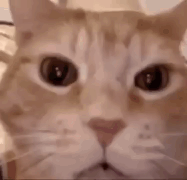

# SkillIssue

> **Your code failed. The cat knows. The cat is laughing at you.**



You ran the build. The build said **no.** And now, from the comfort of your own
editor, a cat is laughing at you.

**SkillIssue** does exactly one thing: when a build, test, lint or compile
**fails**, it pops up a laughing cat and plays the cackle. When your code passes,
it says nothing — because there's nothing to laugh at. *Yet.*

It's not a productivity tool. It's a personality test your CI keeps failing.

---

## The cat has rules (reluctantly)

- **It's a heckler, not a saboteur.** SkillIssue is strictly *observational* — it
  never touches your exit codes, output or command behaviour. Your build fails
  *exactly* as hard as it would without the cat. The cat just provides commentary.
- **It never grabs the wheel.** The panel shows up without stealing your cursor,
  chuckles for a few seconds, then leaves (a click, `Esc`, or the tab's × — the cat
  takes the hint).
- **If the cat breaks, you never pay for it.** Any hiccup inside SkillIssue is
  contained and logged. A meme failure will never turn into a
  *now-your-build-also-fails* failure.

---

## What makes the cat laugh

Failed **VS Code tasks**, failed Jest tests launched from Explorer/Testing via
**Jest (`orta.vscode-jest`)**, and failed build/test/lint commands typed straight
into the **integrated terminal** — `npm test`, `tsc`, `next build`, `cargo test`,
`go vet`, you name it.

What *doesn't* make the cat laugh: `git`, `ls`, `grep`, `cd` and every other scrap
of ordinary shell noise. The cat has standards. (Terminal roasting needs VS Code's
shell integration switched on for that terminal.) Jest Testing UI support observes
the extension's structured JSON report rather than scraping its output; because
that report is an internal vscode-jest detail, a future vscode-jest update may
require a SkillIssue compatibility update.

---

## The laugh

The cackle plays **in the background** through your OS's own audio player — no
click required, and audible **even when VS Code isn't focused**, because we know
you alt-tab away from your failures. It plays twice, because one laugh just isn't
enough.

| Platform | Who does the laughing |
| -------- | --------------------- |
| macOS | `afplay` |
| Linux / WSL | `paplay` → `aplay` → `mpv` → `ffplay` (first one it finds) |
| Windows | PowerShell `System.Media.SoundPlayer` |

No player on your machine? The cat laughs silently in your heart (read: it stays
quiet and never blocks anything). Miss the old in-panel audio? Set
`skillissue.sound.backend` to `webview` — fair warning, browsers gate autoplay, so
that mode needs one click the first time to wake the cat up.

---

## Summon the cat on purpose

Command Palette (`Ctrl/Cmd+Shift+P`) → **SkillIssue: Preview Reaction**. Instant
laugh, no failure required — perfect for when you just want to vibe with the cat.
Everything it does is logged under the **SkillIssue** channel in the **Output**
view, in case you want receipts.

---

## Commands

| Command | What it does |
| ------- | ------------ |
| **SkillIssue: About** | A tiny note about the extension. Thrilling. |
| **SkillIssue: Preview Reaction** | Summons the laughing cat right now. Failure optional. |

---

## Tune the torment

Open Settings (`Ctrl/Cmd+,`), search **"SkillIssue"**, and adjust to taste.
Changes apply instantly — no reload, no rebuild, no mercy.

| Setting | Default | What it does |
| ------- | ------- | ------------ |
| `skillissue.enabled` | `true` | Master switch. Off means the cat is asleep and never reacts. |
| `skillissue.sound.enabled` | `true` | Play the laugh with the reaction (it plays 2×). |
| `skillissue.sound.volume` | `1` | Laugh volume, from `0` (mute the cat) to `1` (full cackle). |
| `skillissue.sound.backend` | `system` | `system` = background native OS player (no click, works unfocused); `webview` = in-panel audio (may need one click to unlock). |
| `skillissue.reaction.durationSeconds` | `5` | Minimum time the cat lingers before dismissing (or, on the `webview` backend, quieting to a "listening" idle that keeps audio unlocked) — it never leaves before the laugh has finished; `0` keeps it up until you wave it off. |
| `skillissue.reaction.cooldownSeconds` | `0` | Minimum gap between laughs; `0` = the cat reacts every single time. |
| `skillissue.workflows.monitoredKinds` | `[]` | Which kinds to watch (`test`, `build`, `compile`, `lint`, `script`, `unknown`); empty = watch everything. |
| `skillissue.workflows.include` | `[]` | Only laugh when the name contains one of these substrings; empty = include all. |
| `skillissue.workflows.exclude` | `[]` | Never laugh when the name contains one of these (beats `include`). |
| `skillissue.workflows.treatCancellationAsFailure` | `false` | Laugh when you cancel a monitored run. The cat notices. |
| `skillissue.workflows.treatUnknownAsFailure` | `false` | Laugh when a run ends with an unknown result. |
| `skillissue.workflows.detectTerminalCommands` | `true` | Also laugh at build/test/lint commands typed in the integrated terminal (needs shell integration); ordinary commands are ignored. |
| `skillissue.repeatedFailures` | `always` | `always` = laugh at every failure in a streak; `first-only` = laugh once, then wait for you to fix it. |

---

## Get judged (install)

Not on the Marketplace yet — the cat's still grooming. Install from source:

```bash
npm install
npm run package                              # produces skillissue-<version>.vsix
code --install-extension skillissue-0.0.1.vsix
```

Reload VS Code, run **SkillIssue: Preview Reaction** to confirm the cat is
laughing, then go fail a build. You know you want to.

---

## The fine print

The **source code** is MIT — see `LICENSE`. Free as in "go ahead."

The **cat-meme media** (`assets/orange-cat-laughing.gif`, `cat-laughing-at-you.mp3`
/ `.wav` and `cat-laughing-cat-laughing-meme.png`) are third-party novelty assets
of unclear provenance and are **not** MIT-covered — the cat is famous, but not
*free*. The **icon** (`assets/icon.png`) is original artwork made for this project.

---

Want to teach the cat new ways to laugh? See `CONTRIBUTING.md` for the dev guide
and `docs/ARCHITECTURE.md` for why the cat is built the way it is.
